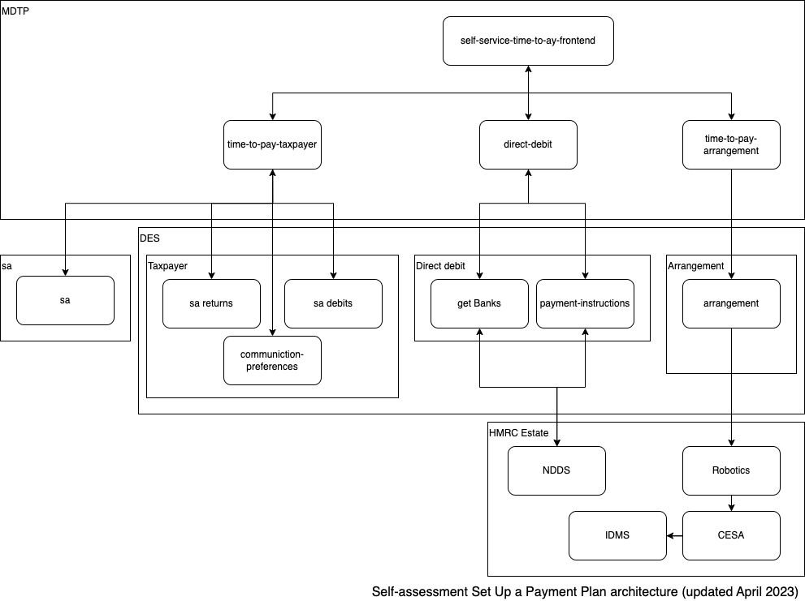

# self-service-time-to-pay-frontend


Tip: Connect to VPN in order to build it.  

### About 
Self Service Time To Pay Frontend is the frontend microservice for Pay What You Owe In Instalments.
It displays the web pages that users interact with and contacts multiple backend services to retrieve and store information.
It has multiple endpoints that are navigated through in sequence, beginning with eligibility, through to calculator and then arrangement.
The following diagram shows the overview of the SSTTP architecture.

<a href="https://github.com/hmrc/self-service-time-to-pay-frontend">
    <p align="center">
      
    </p>
</a>

### Quickstart in local

#### Running
From source use ```sbt runTestOnly```

From service manager profile use ```sm --start SSTTP -r```

#### For session debug purposes and test journey helpers
http://localhost:9063/pay-what-you-owe-in-instalments/test-only/inspector 

#### For first page (logged out)
http://localhost:9063/pay-what-you-owe-in-instalments

#### For starting with a logged in eligible user  

- First go to http://localhost:9063/pay-what-you-owe-in-instalments/test-only/inspector
- Choose 'create user and log in' link
- Accept default 'Frozen Date' so this is in alignment with the default test data in the stubs for the happy path where the customer is eligible.
- Click 'create user and log in' button
- Go to the first page at http://localhost:9063/pay-what-you-owe-in-instalments 
- Clicking the 'Start now' button will now take you to http://localhost:9063/pay-what-you-owe-in-instalments/calculator/tax-liabilities as if you were an eligible taxpayer

#### Note about integration tests

Nb: Running the integration tests locally - i.e. `sbt test`- may require that ASSETS_FRONTEND is not running locally.
  
### Further information

- [Confluence space](https://confluence.tools.tax.service.gov.uk/display/SSTTP)
- [Test data and environment details](https://confluence.tools.tax.service.gov.uk/display/SSTTP/Testing+-+Development+environment+test+data)

- [UI acceptance tests](https://github.com/hmrc/self-service-time-to-pay-acceptance-tests)

- [Performance tests](https://github.com/hmrc/self-service-time-to-pay-performance-tests)

---

### License

This code is open source software licensed under the [Apache 2.0 License]("http://www.apache.org/licenses/LICENSE-2.0.html").

